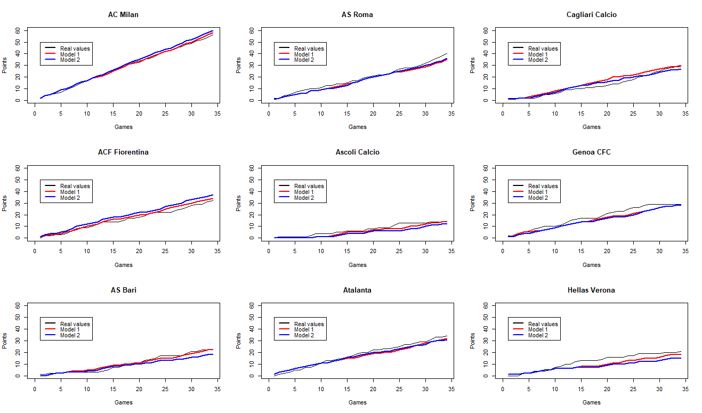
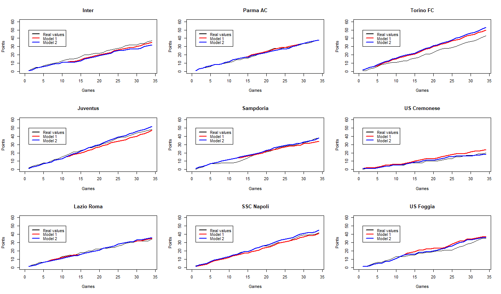
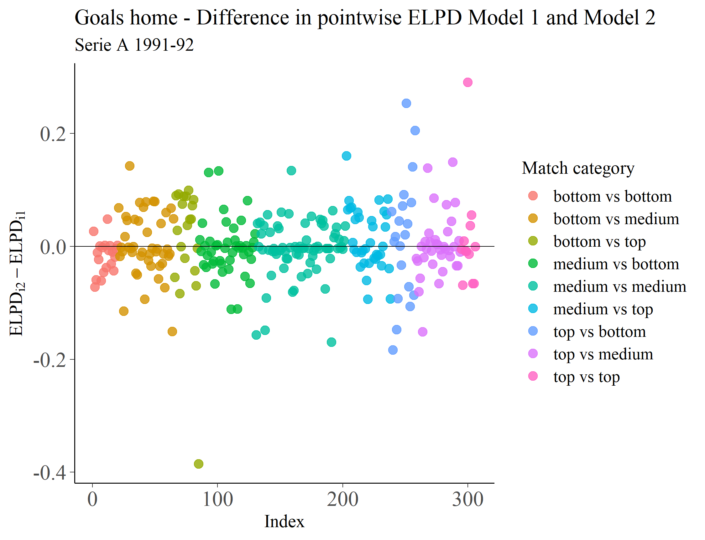
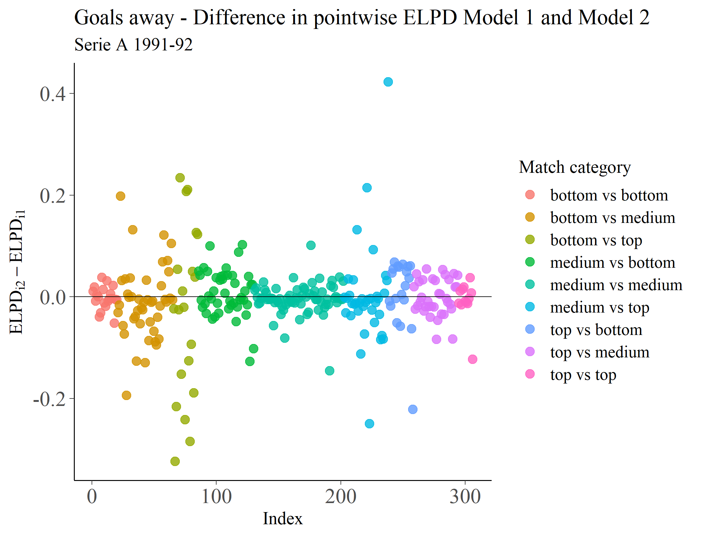

```{r setup, include=FALSE}
knitr::opts_chunk$set(echo = TRUE)
```

##### [Source code](https://github.com/RobertoCorti/Bayesian-Statistics/tree/main/project)

### Introduction

Being one of the most popular sports in the world, in recent years football data analysis has become an interesting field of study. The aim of this project is to replicate the work of Baio, G., Blangiardo, M. (2010), that propose a Bayesian model for modeling the number of goals scored during a football match. In order to compare the results with the ones of this work, all the analysis has been conducted by using the data about the Italian Serie A championship 1991-1992. 


### Exploratory data analysis

For collecting the data, the R package `engsoccerdata` was used. This dataset contains many of the results for National Leagues, European Cup and Champions League matches (including qualifiers) from 1871 to 2016. The section `italy` consists of 25404 match-observations on the following 8 variables:

* `Date` Date of match
* `Season` Season of match - refers to starting year
* `home` Home team
* `visitor` Visiting team
* `FT` Full-time result at 90 mins
* `hgoal` home goals at FT 90mins
* `vgoal` visitor goals at FT 90mins
* `tier` tier of football pyramid: 1

```{r, warning=FALSE, echo=FALSE, message=FALSE}
library(engsoccerdata)
library(dplyr)
library(tidyr)
library(knitr)
library(rstan)


df <- engsoccerdata::italy
kable(head(df))
```


As previously cited, since the aim is to replicate the study of Baio, G., Blangiardo, M. (2010), all the data analysis will be conducted by using the data of the Italian championship 1991-1992: 

```{r, echo=FALSE}
df <- engsoccerdata::italy

df <- df %>% 
        filter(Season == 1991)

df <- df %>%
  group_by(home) %>%
  mutate(home_id=cur_group_id())

df <- df %>%
  group_by(visitor) %>%
  mutate(visitor_id=cur_group_id())

kable(head(df))
```

Once provided a proper dataset that summarizes all the matches, the first step is to extract from it some useful information.


The first question that may arise by aiming to model the number of goals in a football match is to understand if there is any difference between local and visitor teams' number of goals. A first overview can be done by looking to the distribution of the results of the season:

```{r, fig.align='center', fig.width=12, fig.height=6, echo=FALSE}
library(ggplot2)
pippo <- ggplot(df, aes(x = FT)) + 
  geom_bar(position = "stack", color="black", fill="darkblue")+
  theme_classic()+
  ggtitle("Which was the most common result?", subtitle="Distribution of results in Serie A 1991-1992")+
  labs(x="Result", y="Count")+
  theme(plot.title = element_text(size = 20, face = "bold"))

plot(pippo)
```
In the total 306 games, the home team won in 128 occasion, while only in 67 matches there is an away victory. It looks that when a team plays at home tends to score more goals.

This effect is a well-known phenomena in  team sports. This benefit has been attributed to psychological effects supporting fans have on the competitors to psychological or physiological advantages of playing near home in familiar situations. 

This effect in the 1991-92 Serie A can be noticed more by visualizing the histograms of the number of goals made by the local and the visitor team:


```{r, fig.align='center', fig.width=12, fig.height=6, echo=FALSE}
library(cowplot)

hgoal_hist <- ggplot(df, aes(x = hgoal)) + 
  geom_bar(position = "stack", color="black", fill="darkblue")+
  theme_classic()+
  ggtitle("Home goals", subtitle="Distribution of goals made by home team in a game")+
  labs(x="Number of goals", y="Count")+
  theme(plot.title = element_text(size = 20, face = "bold"))

vgoal_hist <- ggplot(df, aes(x = vgoal)) + 
  geom_bar(position = "stack", color="black", fill="darkblue")+
  theme_classic()+
  ggtitle("Visitor goals", subtitle="Distribution of goals made by away team in a game")+
  labs(x="Number of goals", y="Count")+
  theme(plot.title = element_text(size = 20, face = "bold"))

cowplot::plot_grid(hgoal_hist, vgoal_hist)


```

It can be the case that this difference will be not true for all the teams. It can be checked by evaluating the number of goals that each team has made as a local and as a visitor:

```{r, fig.align='center', fig.width=17, fig.height=8, echo=FALSE}
library(grid)

df_goals <- readRDS("data/season1991_goals.rds")

df_goals_long <- df_goals %>% 
  select(team_name, goals_made_home, goals_made_visitor) %>% 
  gather("Stat", "Value", -team_name)

plot_goals <- ggplot(df_goals_long, aes(x = team_name, y = Value, fill = Stat)) +
  geom_col(position = "stack")+
  theme(legend.title = element_blank()) +
  geom_text(aes(label = Value), size = 5, position = position_stack(vjust = 0.5))+
  ggtitle("Do teams score more at home?", subtitle="Distribution of team goals in Serie A 1991-1992")+
  labs(x="Team", y="Number of goals")+
  theme_classic()+
  scale_fill_discrete(
    labels = c("Goals made at home", "Goals made away")
  )+
  theme(plot.title = element_text(size = 23, face = "bold"))


plot(plot_goals)
```

A part from some exceptions (Atalanta, Inter and Roma) the majority of the teams shows a significant difference among the goals made in their stadium and away. Thus, by modeling such quantities this global home-bias effect has to be taken into consideration.

To improve our knowledge and increase the complexity of our models, some possible sources of heterogeneity among teams are needed to be found. This can be done by taking a look to the final classification of the championship:


```{r, echo=FALSE,layout="l-body-outset"}

df_ranking <- readRDS("data/season1991_ranking.rds")
kable(df_ranking)
```

It is well known that more developed teams tend to acquire better players and, therefore, they will perform better offensively and defensively. These teams (ike AC Milan, Juventus, SSC Napoli) are characterized to be at the top positions of the table and with a positive goal difference. On the other hand, teams that are used to fight for relegation (like US Cremonese, Ascoli Calcio and Hellas Verona) tend to be less skilled due to their lack of talented players, Therefore, they tend to have poor offensive and defensive abilities and they are characterized by a huge negative goals difference. In the middle of these two extremes, there will be teams that performs good in attack and bad in defense (like US Foggia) or, alternatively, bad in attack and good in defense (like Inter), resulting in a nearby 0 goals difference.

This difference can be shown explicitly by plotting for each team their total number of goals received and made:

```{r, fig.align='center', fig.width=17, fig.height=8, echo=FALSE}
library(grid)
grob <- grobTree(textGrob("Goals made = Goals received", x=0.75,  y=0.86, hjust=0,
                          gp=gpar(col="black", fontsize=13, alpha=0.4)))

tot_goals <- ggplot(df_goals,  aes(x=goals_received, y=goals_made, colour=rank)) +
  geom_point(size=3) +
  geom_text(aes(label=team_name),hjust=0, vjust=0) +
  annotation_custom(grob)+
  geom_abline(slope = 1, intercept = 0, color="black", linetype="dashed", size=1.5, alpha=0.2)+
  ggtitle("Total goals made vs received", subtitle="Serie A 1991-1992")+
  labs(x="Goals received", y="Goals made")+
  theme_bw()+
  theme(plot.title = element_text(size = 23, face = "bold"))

plot(tot_goals)
```


### Model description

Based on these previous observations, let's start to describe the two models adopted by Baio, G., Blangiardo, M. (2010). 

Before introducing them, let's review some notation: the league is made by a total of $T = 18$ teams, playing each other twice in a season (one at home and one away). The number of goals scored by the home and by the away team in the g−th game of the season ($g = 1, . . . , G = 306$) are indicated as $y_{g1}$ and $y_{g2}$.


#### Model 1
The vector of observed counts in a given game $y_g=(y_{g1}, y_{g2})$ is modeled as a set vector made by two independent random variables that follows the Poisson distribution:

$$ y_{gj} | \theta_{gj} \sim \text{Poisson}(\theta _{gj}), $$
where $\theta_g = (\theta_{g1}, \theta_{g2})$ represent the scoring intensity in the g-th game for the team that plays at home ($j=1$) and away ($j=2$), respectively and the nested indexes $h(g), a(g)=1, ..., T$ identify the team that is playing at home and away in the $g$-th game. The intensity vector $\theta$ is modeled by using a log-linear random effect:

$$ \log{\theta_{g1}} = home ~ + att_{h(g)} ~ + def_{a(g)},$$
$$ \log{\theta_{g2}} =  att_{a(g)} ~ + def_{h(g)}. $$
The scoring intensities for the home and away team are determined jointly by the attack and defense ability of the team involved. For the home team, its scoring intensity will be determined by its offensive skills and by the strength of the defense of the away team. The reciprocal scenario happens in the away team scoring ability, which is determined by the away team's offense and the home team's defense. In addition to that, the  parameter $home$ represents an additional bias that take into consideration the advantage of the home team by playing in its stadium. This effect is assumed as constant for all the teams throughout the season and so it will be modeled as a fixed effect.

For each $t=1, ..., T$, the team-specific $att_t$, $def_t$ effects parameters are modeled by assuming exchangeability:

$$ att_t \sim \mathcal{N}(\mu_{att}, \tau^{-1}_{att}),  ~ ~  ~ ~  ~ ~ ~ ~ ~ ~ ~ ~ ~ ~ def_t  \sim \mathcal{N}(\mu_{def}, \tau^{-1}_{def}). $$ 

Moreover identifiability constraints on the team specific parameters are applied:

$$ \sum_{t=1}^T att_t = 0, ~ ~  ~ ~  ~ ~ ~ ~ ~ ~ ~ ~ \sum_{t=1}^T def_t=0.   $$ 


#### Model 2

During the exploratory analysis it has been viewed that attack and defense skills can vary differently once we go from teams that compete for the title to others that are struggling for relegation. The previous model assumes that all team-wise attacks and defenses parameters are coming from a common population distribution. In order to take into account this source of heterogeneity, a more complex model is proposed for the team-specific $att_t$, $def_t$ effects parameters. 

The following model considers the same assumptions for the number goals distribution and the home effect; the random parameters are instead modeled differently. There are allowed three different generating mechanism: one for top teams, one for middle-table team and one for bottom-table team.
For each team it is defined a vector of probabilities $\pi^{att}_t = (\pi^{att}_{t,1}, \pi^{att}_{t,2}, \pi^{att}_{t,3})$ and $\pi^{def}_t = (\pi^{def}_{t,1}, \pi^{def}_{t,2}, \pi^{def}_{t,3})$ that identify the probability that the attack and the defense ability of the team is one of the three categories. Then, the attack and defense parameters are modeled as a multimodal distribution:
$$ att_t = \sum_{k=1}^3 \pi^{att}_{t,k} ~ \text{nct}(\mu^{att}_k, \sigma^{att}_k, \nu=4), ~ ~  ~ ~  ~ ~ ~ ~ ~ ~ ~ ~ def_t = \sum_{k=1}^3 \pi^{def}_{t,k} ~ \text{nct}(\mu^{def}_k, \sigma^{def}_k, \nu=4). $$

where $\mu^{att}_k, \sigma^{att}_k, \mu^{def}_k, \sigma^{def}_k$ for $k=1,2,3$ are the population mean and precision of the attack and defense effects of the three team categories.

### Model implementation and results

Once introduced the models theoretically, we need to implement them, specifying a prior distribution for the parameters, fitting on the Serie A 1991-92 data and compare the results with the ones of Baio, G., Blangiardo, M. (2010).

Both models have been implemented with the `rstan` package and fitted by using Hamiltonian Monte Carlo (HMC).

#### Model 1

[Stan code](https://github.com/RobertoCorti/Bayesian-Statistics/blob/main/project/model_1.stan)

As done in Baio, G., Blangiardo, M. (2010), the prior distributions for the hyper-parameters and the home effect are modeled independently by using non-informative prior distributions:

$$ home \sim \mathcal{N}(0, 1000) $$

$$ \mu_{att} \sim \mathcal{N}(0, 1000), ~ ~  ~ ~  ~ ~ ~ ~ ~ ~ ~ ~ ~ ~  \mu_{def} \sim \mathcal{N}(0, 1000), $$

$$ \tau_{att} \sim \text{Gamma}(0.1, 0.1), ~ ~  ~ ~  ~ ~ ~ ~ ~ ~ ~ ~ ~ ~  \tau_{def} \sim \text{Gamma}(0.1, 0.1). $$

The following tables shows the 95% credible intervals for the posterior distribution of the parameters:

**Attack**

```{r, echo=FALSE}

fit_model_1 <- readRDS("models/model_1_fit_1991.rds")

summary_model_1_att <- rstan::summary(fit_model_1, pars=c("att", "att_team"))
summary_model_1_att_df <-  as.data.frame(summary_model_1_att$summary) %>%
                                select(-c(se_mean, sd, "25%", "75%", n_eff, Rhat))

rownames(summary_model_1_att_df) <- c("mu_att", sort(unique(df$home)))

kable(summary_model_1_att_df)
```
**Defense**
```{r, echo=FALSE}


summary_model_1_def <- rstan::summary(fit_model_1, pars=c("def", "def_team"))
summary_model_1_def_df <-  as.data.frame(summary_model_1_def$summary) %>%
                                 select(-c(se_mean, sd, "25%", "75%", n_eff, Rhat))

rownames(summary_model_1_def_df) <- c("mu_def", sort(unique(df$home)))

kable(summary_model_1_def_df)
```

**Home**
```{r, echo=FALSE}


summary_model_1_home <- rstan::summary(fit_model_1, pars=c("home"))
summary_model_1_home_df <-  as.data.frame(summary_model_1_home$summary) %>%
                                 select(-c(se_mean, sd, "25%", "75%", n_eff, Rhat))


kable(summary_model_1_home_df)
```

All the intervals are in accordance with the ones reported in Baio, G., Blangiardo, M. (2010).
The home effect is positive and this is coherent with the fact seen before that the majority of wins are made by the home team. AC Milan, the league winner, have the highest propensity to score. The top three clubs (AC Milan, Juventus and Torino) results the best ones in terms of defense showing the lowest values for the parameter $def$, while Ascoli, Foggia and Verona showed the highest propensity to concede goals by having the highest values of $def$.


#### Model 2 

[Stan code](https://github.com/RobertoCorti/Bayesian-Statistics/blob/main/project/model_2.stan)

By aiming to to represent different types of team behaviors, this model requires a huge increase in the number of parameters to fit. In this context using a non-informative prior has lead to a very vague posterior distribution and to a divergent scenario of the Hamiltonian Monte Carlo Scenario. For this reason, it has been made the decision to use informative priors based on past knowledge of the parameters of interests.

Starting from the team-probabilities parameters $\pi^{att}_t, \pi^{def}_t$, a Dirichlet distribution is adopted:
$$ \pi^{att}_t \sim \text{Dirichlet}(\alpha_t), ~ ~  ~ ~  ~ ~ ~ ~ ~ ~ ~   \pi^{def}_t \sim \text{Dirichlet}(\alpha_t) $$
The hyper-parameters vectors $\alpha_t \in (\mathbb{R}^+)^3$ are taken uniform equal to $(1, 1, 1)$ by Baio, G., Blangiardo, M. (2010) in order to specify no information on the prior probability that a given team is one of the three categories. It is possible to specify a more informative prior distribution by looking to the recent history of each team in the past Serie A championships. Based on that idea, the specification of the hyper-parameters vectors $\alpha_t$ is made in the following way:

* for each $k=1, 2, 3, ~ ~ ~ ~ \alpha_{t,k} = 1 + n_{t,k}$, where $n_{t,k}$ is the number of times that the $t$-th team has appeared in the last 5 seasons in the $k$-th part of the table. 

In this way, for example, a team like AC Milan or Juventus that have been 4 times in the top-4 positions in the last 5 campaigns prior to 1991, will have a $\mathbb{E}[\pi^{att}_{t,top}] = \mathbb{E}[\pi^{def}_{t,top}] = 5/8 \simeq  0.625$ . This prior information can help the model to "detect" which kind of team belong to one of the three categories, since historically teams that are used to finish at the top will also have more financial possibilities for acquiring the best players in the market.

For what concerns the prior distribution of the population parameters $\mu^{att}_k, \sigma^{att}_k, \mu^{def}_k, \sigma^{def}_k$ it is assumed that:

* the offensive contribution for top-table clubs must be positive, while the defensive contribution has to be negative,

* the offensive contribution for bottom-table clubs must be negative, while the defensive contribution has to be positive.

Moreover, in order to add more information, it has been seen from the first model that location parameters are very rare to get values greater than $1$. Therefore, the following prior distributions have been selected:

* **bottom-table teams**: 
$$ \mu^{att}_{1} \sim \text{TruncNormal}(0, 1, -3, 0),   ~ ~ ~ ~ \sigma^{att}_{1} \sim \text{InvGamma}(1, 1), $$
$$ \mu^{def}_{1} \sim \text{TruncNormal}(0, 1, 0, 3),   ~ ~ ~ ~ \sigma^{def}_{1} \sim \text{InvGamma}(1, 1). $$
* **medium-table teams**: 
$$ \mu^{att}_{2} \sim \text{Normal}(0, 0.5),   ~ ~ ~ ~ \sigma^{att}_{2} \sim \text{InvGamma}(1, 1), $$
$$ \mu^{def}_{2} \sim \text{Normal}(0, 0.5),   ~ ~ ~ ~ \sigma^{def}_{2} \sim \text{InvGamma}(1, 1). $$
* **top-table teams**: 
$$ \mu^{att}_{3} \sim \text{TruncNormal}(0, 1, 0, 3),   ~ ~ ~ ~ \sigma^{att}_{3} \sim \text{InvGamma}(1, 1), $$
$$ \mu^{def}_{3} \sim \text{TruncNormal}(0, 1, -3, 0),   ~ ~ ~ ~ \sigma^{def}_{3} \sim \text{InvGamma}(1, 1). $$
As made with Model 1, the following tables report the 95% credible intervals for the team attack, defense and home parameters:

**Attack**

```{r, echo=FALSE}

fit_model_2 <- readRDS("models/model_2_fit_1991.rds")

summary_model_2_att <- rstan::summary(fit_model_2, pars=c("att_top", "att_medium", "att_bottom", "att_team"))
summary_model_2_att_df <-  as.data.frame(summary_model_2_att$summary) %>%
                                select(-c(se_mean, sd, "25%", "75%", n_eff, Rhat))

rownames(summary_model_2_att_df) <- c("mu_att_top", "mu_att_medium", "mu_att_bottom", sort(unique(df$home)))

kable(summary_model_2_att_df)
```
**Defense**
```{r, echo=FALSE}

summary_model_2_def <- rstan::summary(fit_model_2, pars=c("def_top", "def_medium", "def_bottom", "def_team"))
summary_model_2_def_df <-  as.data.frame(summary_model_2_def$summary) %>%
                                select(-c(se_mean, sd, "25%", "75%", n_eff, Rhat))

rownames(summary_model_2_def_df) <- c("mu_def_top", "mu_def_medium", "mu_def_bottom", sort(unique(df$home)))

kable(summary_model_2_def_df)
```

**Home**
```{r, echo=FALSE}


summary_model_2_home <- rstan::summary(fit_model_2, pars=c("home"))
summary_model_2_home_df <-  as.data.frame(summary_model_2_home$summary) %>%
                                 select(-c(se_mean, sd, "25%", "75%", n_eff, Rhat))


kable(summary_model_2_home_df)
```
With respect to Model 1, also in this case the home factor is considered an advantage, the league winner (AC Milan) has the best propensity to score and the worst teams (Ascoli Calcio, Hellas Verona, US Cremonese) are willing to concede a lot of goals. The difference that can be noticed is in the absolute magnitude of attack and defense parameters credible intervals, that seems more biased towards negative values or positive values with respect to the team category. Worst teams of the league looks to be more penalized, while top-teams tend to be more rewarded.  


### Model evaluation

In addition to parameter estimates, the `rstan` package allow the possibility to generate in-sample replications of the goals scored by the home and visitor team during every match of the championship. These "simulated games" can be used to compare these samples to the observed data. To generate the data used for posterior predictive checks the simulations come from the posterior predictive distribution $p(\bar{y} | y) = \int d\theta p(\bar{y}|\theta)\pi(\theta|y)$. For each of the two models, the distributions of the replicated datasets are compared to the empirical distribution of the observed sample. This comparison is done for all the data and by aggregating by team and considering some test statistics such as the mean and the standard deviation.


#### Model 1

```{r, fig.align='center', fig.width=10, fig.height=5, echo=FALSE}
y_home_rep <- readRDS("simulations/y_home_rep_model_1_1991.rds")
y_away_rep <- readRDS("simulations/y_away_rep_model_1_1991.rds")


ppc_home <- bayesplot::ppc_bars(df$hgoal, y_home_rep[2000:4000,]) +
  ggtitle("Posterior predictive histogram of home goals", subtitle = "Serie A 1991-92")+
  xlab("Number of home goals")

ppc_away <- bayesplot::ppc_bars(df$vgoal, y_away_rep[2000:4000,]) + 
  ggtitle("Posterior predictive histogram of away goals", subtitle = "Serie A 1991-92")+
  xlab("Number of away goals")

cowplot::plot_grid(ppc_home, ppc_away)
```


```{r, fig.align='center', fig.width=15, fig.height=8, echo=FALSE}

ppc_home_group <- bayesplot::ppc_bars_grouped(df$hgoal, y_home_rep[2000:4000,], group = df$home)  + ggtitle("Posterior predictive histogram of home goals per team", subtitle = "Serie A 1991-92")

ppc_away_group <- bayesplot::ppc_bars_grouped(df$vgoal, y_away_rep[2000:4000,], group = df$visitor)+
  ggtitle("Posterior predictive histogram of away goals per team", subtitle = "Serie A 1991-92")

cowplot::plot_grid(ppc_home_group, ppc_away_group)
```

```{r, fig.align='center', fig.width=15, fig.height=8, echo=FALSE}

mean_ppc_home <- bayesplot::ppc_stat_grouped(
  y = df$hgoal,
  yrep = y_home_rep,
  group = df$home,
  stat = 'mean',
  binwidth = 0.1
) + ggtitle("Mean home goals vs posterior predictive sample medians", subtitle = "Serie A 1991-92")
mean_ppc_away <- bayesplot::ppc_stat_grouped(
  y = df$vgoal,
  yrep = y_away_rep,
  group = df$visitor,
  stat = 'mean',
  binwidth = 0.1
) + ggtitle("Mean away goals vs posterior predictive sample medians", subtitle = "Serie A 1991-92")


cowplot::plot_grid(mean_ppc_home, mean_ppc_away)
```
```{r, fig.align='center', fig.width=15, fig.height=8, echo=FALSE}

std_ppc_home <- bayesplot::ppc_stat_grouped(
  y = df$hgoal,
  yrep = y_home_rep,
  group = df$home,
  stat = 'sd',
  binwidth = 0.1
) + ggtitle("Std. dev. home goals vs posterior predictive sample medians", subtitle = "Serie A 1991-92")

std_ppc_away <- bayesplot::ppc_stat_grouped(
  y = df$vgoal,
  yrep = y_away_rep,
  group = df$visitor,
  stat = 'sd',
  binwidth = 0.1
) + ggtitle("Std. dev. away goals vs posterior predictive sample medians", subtitle = "Serie A 1991-92")


cowplot::plot_grid(std_ppc_home, std_ppc_away)
```

#### Model 2

```{r, fig.align='center', fig.width=10, fig.height=5, echo=FALSE}
y_home_rep_2 <- readRDS("simulations/y_home_rep_model_2_1991.rds")
y_away_rep_2 <- readRDS("simulations/y_away_rep_model_2_1991.rds")


ppc_home_2 <- bayesplot::ppc_bars(df$hgoal, y_home_rep_2[2000:4000,]) +
  ggtitle("Posterior predictive histogram of home goals", subtitle = "Serie A 1991-92")+
  xlab("Number of home goals")

ppc_away_2 <- bayesplot::ppc_bars(df$vgoal, y_away_rep_2[2000:4000,]) + 
  ggtitle("Posterior predictive histogram of away goals", subtitle = "Serie A 1991-92")+
  xlab("Number of away goals")

cowplot::plot_grid(ppc_home_2, ppc_away_2)
```


```{r, fig.align='center', fig.width=15, fig.height=8, echo=FALSE}

ppc_home_group_2 <- bayesplot::ppc_bars_grouped(df$hgoal, y_home_rep_2[2000:4000,], group = df$home)  + ggtitle("Posterior predictive histogram of home goals per team", subtitle = "Serie A 1991-92")

ppc_away_group_2 <- bayesplot::ppc_bars_grouped(df$vgoal, y_away_rep_2[2000:4000,], group = df$visitor)+
  ggtitle("Posterior predictive histogram of away goals per team", subtitle = "Serie A 1991-92")

cowplot::plot_grid(ppc_home_group_2, ppc_away_group_2)
```

```{r, fig.align='center', fig.width=15, fig.height=8, echo=FALSE}

mean_ppc_home_2 <- bayesplot::ppc_stat_grouped(
  y = df$hgoal,
  yrep = y_home_rep_2,
  group = df$home,
  stat = 'mean',
  binwidth = 0.1
) + ggtitle("Mean home goals vs posterior predictive sample mean", subtitle = "Serie A 1991-92")
mean_ppc_away_2 <- bayesplot::ppc_stat_grouped(
  y = df$vgoal,
  yrep = y_away_rep_2,
  group = df$visitor,
  stat = 'mean',
  binwidth = 0.1
) + ggtitle("Mean away goals vs posterior predictive sample mean", subtitle = "Serie A 1991-92")


cowplot::plot_grid(mean_ppc_home_2, mean_ppc_away_2)
```


```{r, fig.align='center', fig.width=15, fig.height=8, echo=FALSE}

std_ppc_home_2 <- bayesplot::ppc_stat_grouped(
  y = df$hgoal,
  yrep = y_home_rep_2,
  group = df$home,
  stat = 'sd',
  binwidth = 0.1
) + ggtitle("Std. dev. home goals vs posterior predictive sample std. dev.", subtitle = "Serie A 1991-92")

std_ppc_away_2 <- bayesplot::ppc_stat_grouped(
  y = df$vgoal,
  yrep = y_away_rep_2,
  group = df$visitor,
  stat = 'sd',
  binwidth = 0.1
) + ggtitle("Std. dev. away goals vs posterior predictive sample std. dev.", subtitle = "Serie A 1991-92")


cowplot::plot_grid(std_ppc_home_2, std_ppc_away_2)
```

The posterior predictive checks indicates that for both models there are able to simulate data that looks similar to the observed ones. The main issues rely on the evaluation of the standard deviation for some teams like Hellas Verona and Roma, that is expected from the models to be bigger.

### Predictive model comparison

Beyond the aim of estimating the main effects that try to explain the scoring rates, there's also an interest to know the predictive power of the models. For that purpose it has been used the in-sample replications generated by the posterior predicting distribution to "simulate" the development of the championship and create a final rank based on the predictions.

The following figure shows for for each team the cumulative points curve predicted by Model 1 (red) and Model 2 (blue) in comparison with the observed one (black).






For most part of the teams, the estimations provided by Model 1 and Model 2 seem to produce a good fit with no big differences among them. Model 2 looks to provide a slight improvement for teams like US Cremonese, US Foggia and Juventus. Nevertheless, this scenario is not happening for teams like Torino FC or Inter, where Model 2 seems to work even worse than Model 1.

For having a direct measure of the comparison between the predictive performances of the fitted model, thanks to the `loo` package there is the possibility to have an approximate leave-one-out cross-validation (LOO-CV) estimate of the expected log predictive (ELPD) performance on out-of-sample data. The following results are obtained by considering the difference of these estimates for the two models:

**Home goals**:
```{r, warning=FALSE, echo=FALSE, message=FALSE}
library(loo)
loglik1_home <- as.matrix(fit_model_1, pars="log_lik_home")
loglik2_home <- as.matrix(fit_model_2, pars="log_lik_home")

loo1_home <- loo(loglik1_home)
loo2_home <- loo(loglik2_home)

loo_compare(loo1_home, loo2_home)
```

**Away goals**:
```{r, warning=FALSE, echo=FALSE, message=FALSE}
library(loo)
loglik1_away <- as.matrix(fit_model_1, pars="log_lik_away")
loglik2_away <- as.matrix(fit_model_2, pars="log_lik_away")

loo1_away <- loo(loglik1_away)
loo2_away <- loo(loglik2_away)

loo_compare(loo1_away, loo2_away)
```

Model 2 looks to perform slightly better on the task of predicting home goals, while Model 1 seems to be slightly better on away goals. 
Since there's no a huge difference in terms of model predictive performance, one may be interested on the pointwise predictive performance of the model and see which model could be better in order to forecast a given kind of game. In particular, one can be interested to see whether one model is better to predict goals during a match in which teams of the same or different category are opposed. This can be accomplished by looking to the following ELPD pointwise differences:






### Conclusions

The models presented here are an application of Bayesian hierarchical modeling on football data. By fitting them on the 1991-92 Serie A championship the main aim was to retrieve the same results of the paper in which they were proposed.

The estimates of the first model, which relies on a bivariate independent Poisson distribution and exchangeable attack and defense parameters, is in agreement with the results reported in Baio, G., Blangiardo, M. (2010). Moreover, the posterior checks have confirmed that replications generated from the posterior predictive distribution are statistically consistent with the observed ones. 

On the other hand, the second model relies on a mixture structure that takes into account the fact that teams show a different propensity to score and concede goals, as shown in the exploratory analysis. This model becomes more complex, with a greater number of parameters to fit. Due to that, some complications has been found while using HMC with a set of non-informative priors. To fix this problem, a set of informative priors, based on the observation of the Model 1 fit and the historical data, have been provided. With that new information, the posterior performance provided, as expected, more "extreme" offensive and defensive parameters for top/bottom teams. However, the model comparison has shown that there's no great evidence that justify the use of this model with respect to Model 1. 
In order to improve the fit, it would be desirable in the future to perform the following studies:

* Sensitivity analysis on hyper-parameters,

* More prior information on the strength of each team,

* Addition of variables and covariates on the logarithm of the Poisson means, that could take into account some important factors that actual models do not take into account. These could be:
  1. The number of injuries that a given team suffers previous the match,

  2. When a team has played during the week a match of an European competition.

  3. A difference in the supports of the fans. It may be the case that a team receive a more positive $home$ advantage with respect to the others.

